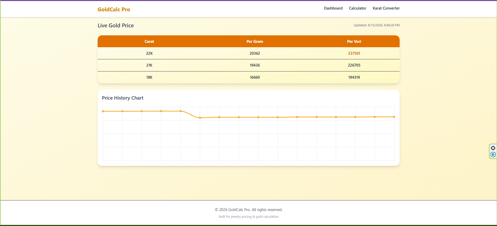
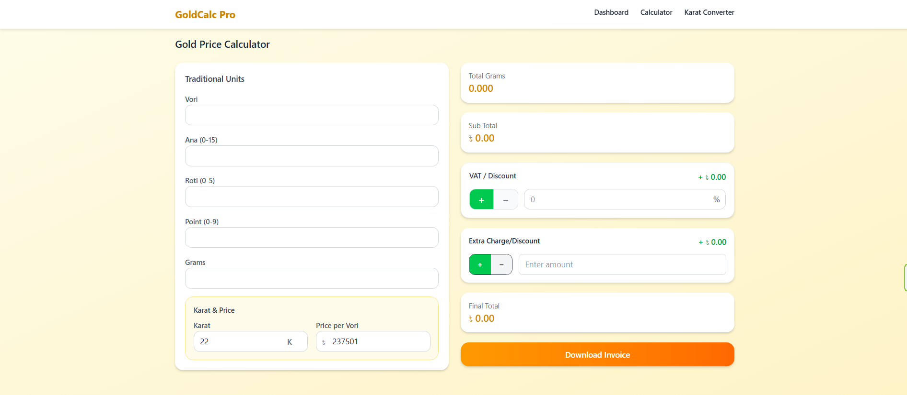
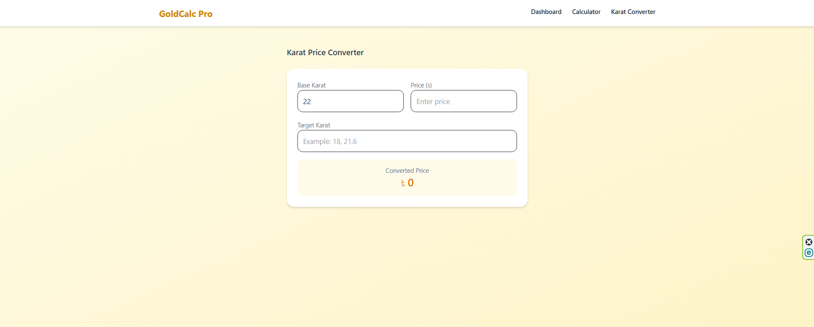

# GoldCalc-Pro
GoldCalc Pro is a modern React-based gold price calculator that provides accurate pricing based on weight, karat, and real-time inputs with a clean and responsive UI.

## Features

- 🔢 Real-time gold price calculation  
- ⚖️ Traditional + gram-based input system  
- 💎 Multiple karat support (18K, 21K, 22K)  
- 📊 Live price dashboard with history chart  
- 🧮 Advanced calculator with VAT & extra charges  
- 🔄 Karat price converter  
- 📄 Invoice download system  
- 📱 Fully responsive UI  

---

## How It Works

GoldCalc Pro calculates total price using:

- Gold weight (Vori, Ana, Roti, Points, Grams)
- Selected karat (purity)
- Price per unit
- VAT / Discount
- Additional charges

Everything updates dynamically for real-time calculation.

---

## Tech Stack

- **Frontend:** React.js  
- **Styling:** Tailwind CSS / Custom CSS  
- **Logic:** JavaScript  

---

## Preview

### Dashboard (Live Gold Price + Chart)

  

---

### Gold Price Calculator

  

---

### Karat Converter

  

---
